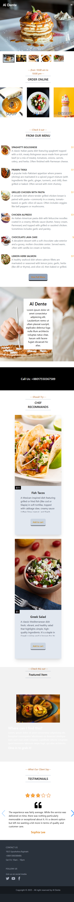
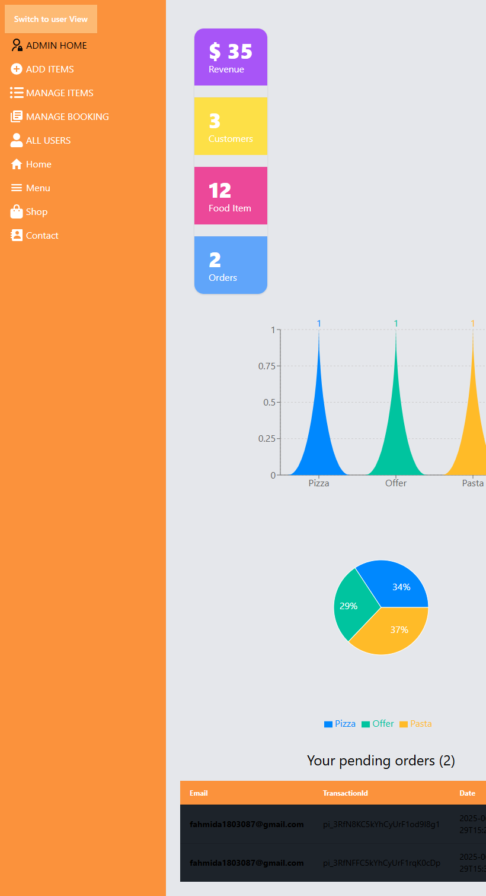
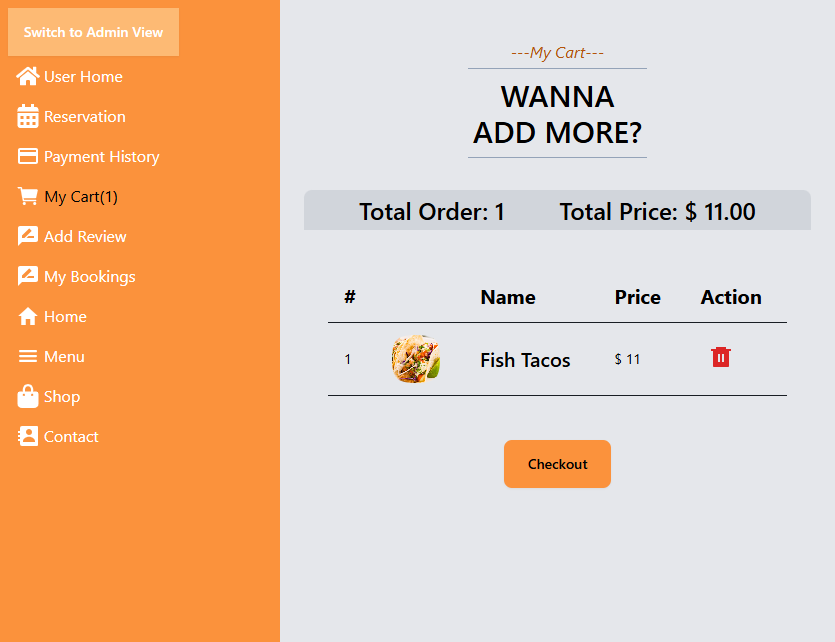

# MERN E-Commerce Webapp

A full-stack end-to-end e-commerce web application built with **MERN STACK** (MongoDB, Express, React, Node.js), featuring **Firebase Authentication**, **Stripe Payment Integration**, **Role-based Dashboards** and real-time updates using **Socket.IO**.
Frontend is hosted on firebase and Backend is deployed on Render.

## Live Demo

[Live Site Link](https://e-commerce-b784b.web.app/)
[Frontend GitHub](https://github.com/FahmidToma/e-commerce-project)
[Backend GitHub](https://github.com/FahmidToma/e-commerce-project-server)

## Tech Stack

- **Frontend:** React.js, React Router, React query, Tailwind CSS, Shadcn, Axios
- **Backend:** Node.js, Express.js
- **Database:** MongoDB (Atlas)
- **Authentication:** Firebase(Email/Password, Google), JWT(Server Side)
- **Others:** Stripe Payment, Socket.IO

## Features

### User

- User registration/login via Firebase (JWT token protected routes)
- View products, add to cart, checkout with Stripe and view payment history
- Take reservations and view booking history, add review
- Real-time booking status updates via Socket.IO

### Admin

- Role-based protected dashboard
- Manage products (Add/Edit/Delete)
- Manage users (promote/demote roles)-----not demote
- View overall stats (orders, revenue, users)
- To have admin view (Log in with)--> **Email: fahmida.02.khatun@gmail.com, Password: Admin125%**

### General

- Fully responsive layout
- Real-time data fetching with React Query
- Secure APIs with role verification

## Screenshots

### Landing Page

### Admin Dashboard

### Cart Page

